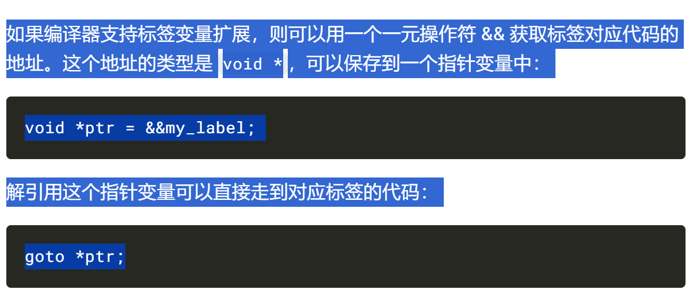
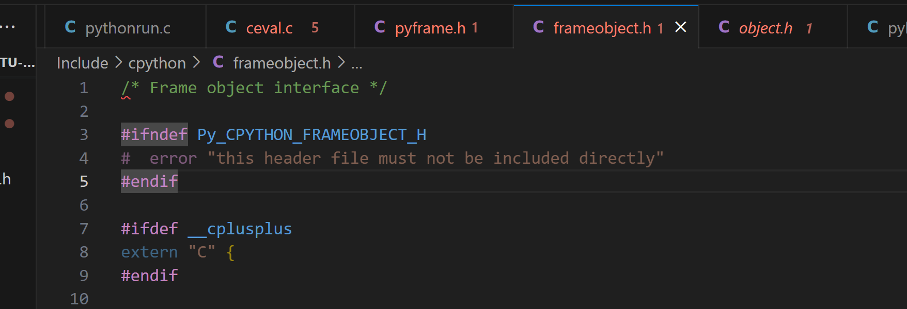
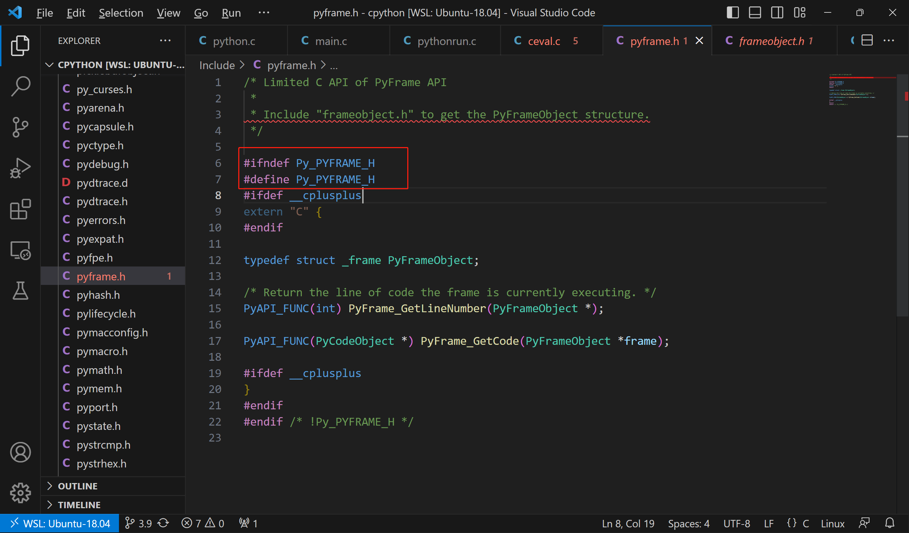
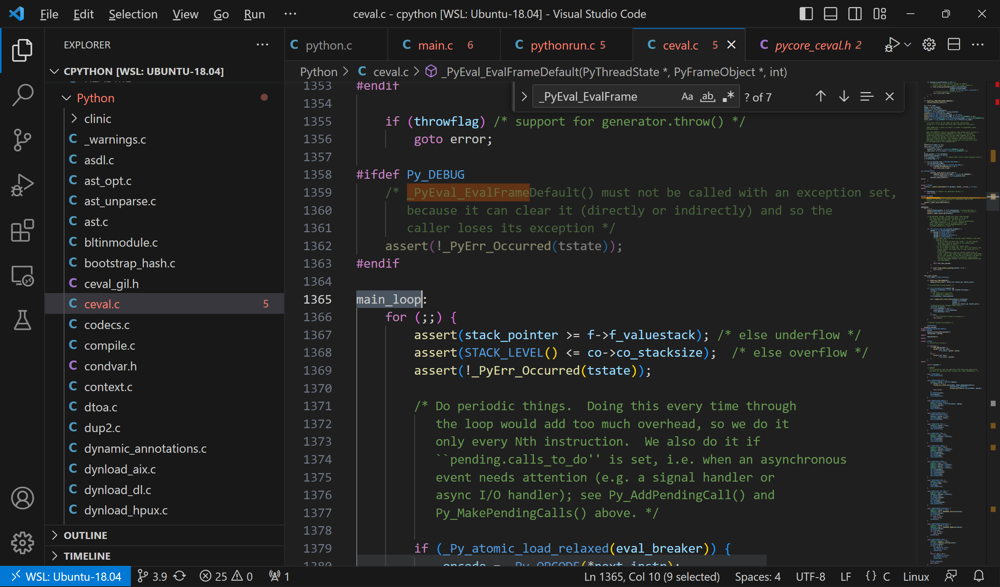
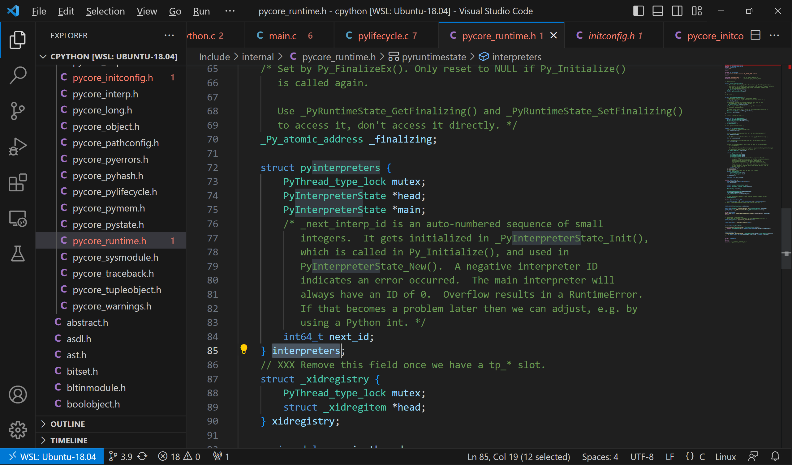
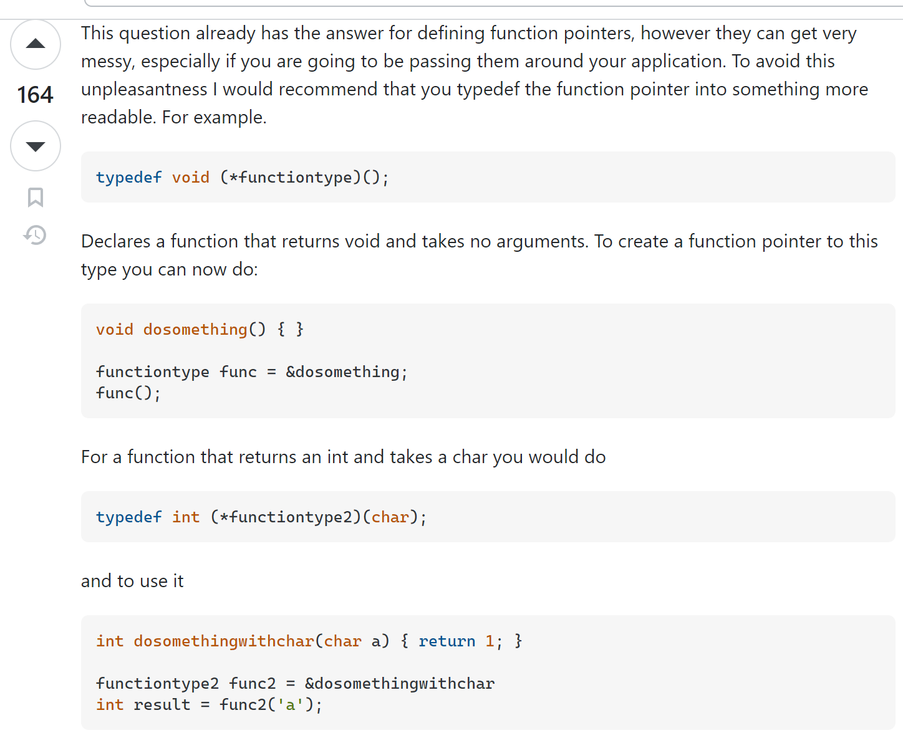
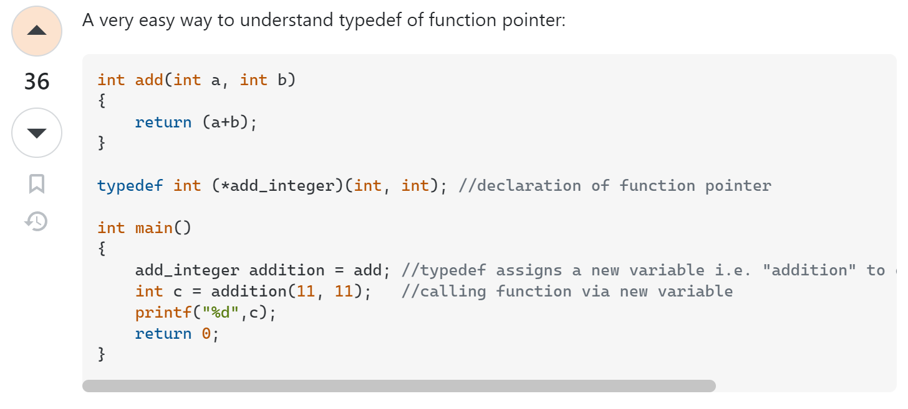
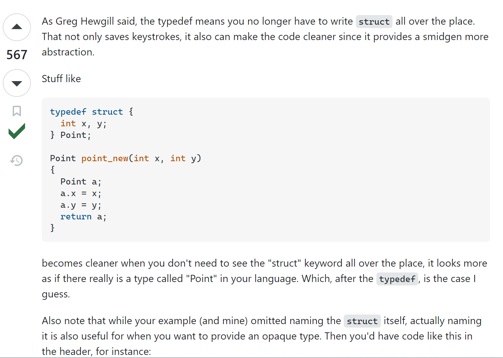
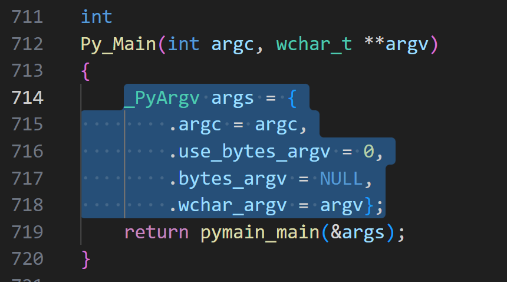

## 一元操作符 && 获取标签对应代码的地址



## 为什么使用 TARGET，`DISPATCH` 之类的宏定义？

求值循环中到处都是 `TARGET()` 、`DISPATCH()` 之类的宏，根据一个特定优化选项的开启情况，这些宏会扩展为不同代码。这个优化选项即“计算跳转”（也叫“线程代码”（threaded code）），开启后，可以利用 CPU 的[分支预测机制](https://en.wikipedia.org/wiki/Branch_predictor)，提高字节码的执行速度。

## 每个文件都要搞一个是吧？？


## 结构体里面定义结构体的指针


## 这空格是个什么鬼？



条件编译（Conditional Compilation）用法，这个空格没什么用。

## 在同一级目录下的.h 文件，可以直接互相使用对方定义的变量嘛？

在同一级目录下的 .h 文件可以相互包含并使用对方定义的变量，但需要注意一些细节：

头文件保护（Header Guards）： 为了避免重复包含同一个头文件，通常在头文件的开头会使用头文件保护宏（header guard macro）。这样可以防止多次包含同一个头文件，避免编译错误。

1. 示例头文件保护的代码：

```c
cCopy code
// 在 headerfile.h 头文件中#ifndef HEADERFILE_H#define HEADERFILE_H// 头文件内容#endif // HEADERFILE_H
```

1. 当一个 .h 文件中定义了头文件保护宏，其他 .h 文件可以多次包含该头文件，但只有第一次包含时才会生效。
2. 正确的包含顺序： 如果两个 .h 文件相互包含，要确保包含的顺序是正确的，以避免循环包含（circular inclusion）问题。
3. 例如，如果 `headerfile1.h` 包含了 `headerfile2.h`，则在 `headerfile2.h` 中不应再包含 `headerfile1.h`，否则会导致循环包含。

正确的包含顺序示例：

```c
cCopy code
// headerfile1.h#ifndef HEADERFILE1_H#define HEADERFILE1_H#include "headerfile2.h"// 头文件内容#endif // HEADERFILE1_H
```

```c
cCopy code
// headerfile2.h#ifndef HEADERFILE2_H#define HEADERFILE2_H// 头文件内容#endif // HEADERFILE2_H
```

1. 全局变量的定义： 如果两个头文件中包含了全局变量的声明，这些变量的定义应该放在一个 .c 文件中，以确保只有一个实际的全局变量定义。
2. 例如，如果在 `headerfile1.h` 和 `headerfile2.h` 中都声明了一个全局变量 `int myVar;`，则应该在一个 .c 文件中定义这个变量，然后在两个头文件中声明它。
3. 示例定义全局变量的代码：

```c
cCopy code
// global.cint myVar; // 实际的全局变量定义// 在 headerfile1.h 和 headerfile2.h 中声明 myVarextern int myVar;
```

总之，同一级目录下的 .h 文件可以相互包含和使用对方定义的变量，但需要遵循头文件保护规范、正确的包含顺序和全局变量的定义方式。

### 头文件保护



这就是个头文件保护。

## C++ 里面调用 C

```
#ifdef __cplusplus
extern "C" {
#endif
这种用法通常用于解决 C++ 代码与 C 代码之间的兼容性
。因为 C++ 具有更丰富的特性和语法，有时需要与 C 代码进行交互，但 C 语言不支持一些 C++ 特性，因此需要通过 extern "C" 来告诉编译器使用 C 调用约定，以确保 C++ 代码与 C 代码可以正确地链接和交互。
```

## Python 的求值循环换位置了



## struct 里面嵌套 struct 用的很多啊

直接声明 + 定义了



## C 语言里面实现回调 callback

在 C 语言中，回调是一种常见的编程模式，它允许将一个函数作为参数传递给另一个函数，从而在某个特定事件发生时执行传递的函数。回调通常用于实现事件处理、异步操作和插件系统等情况。以下是在 C 语言中实现回调的一般步骤：

1. 定义回调函数的类型：
   首先，需要定义回调函数的类型。这是一种函数原型，指定了回调函数应该接受的参数和返回值类型。

```c
cCopy code
typedef void (*CallbackFunction)(int arg);
```

1. 编写回调函数：
   实现一个回调函数，它与之前定义的回调函数类型匹配。

```c
cCopy code
void myCallback(int arg) {
    printf("Callback function called with argument: %d\n", arg);
}
```

1. 接受回调函数作为参数：
   编写一个函数，该函数接受回调函数作为参数，并在适当的时候调用该函数。

```c
cCopy code
void performOperation(int value, CallbackFunction callback) {
    printf("Performing operation with value: %d\n", value);
    callback(value);  // 调用传递的回调函数
}
```

1. 使用回调函数：
   在需要的地方调用带有回调函数参数的函数。

```c
cCopy code
int main() {
    int data = 42;
    performOperation(data, myCallback);
    return 0;
}
```

在上述示例中，`performOperation` 函数接受一个整数值和一个回调函数作为参数。当调用 `performOperation` 时，它执行某个操作并在合适的时候调用传递的回调函数。

## typedef c function pointer

typedef void (*CallbackFunction)(int arg);这是啥啊？

`typedef void (*CallbackFunction)(int arg);` 是在 C 语言中定义了一个函数指针类型 `CallbackFunction`，它指向一个接受 `int` 参数并返回 `void` 的函数。

让我来解释一下这段代码的各个部分：

- `typedef`: 这是 C 语言中用来定义类型别名的关键字。它允许你为已有的数据类型创建一个新的名字，使代码更具可读性和可维护性。
- `void`: 这是一个函数的返回类型，表示函数不返回任何值。
- `(*CallbackFunction)`: 这是一个函数指针的声明。`CallbackFunction` 是我们定义的新类型的名称，`*` 表示这是一个指针，然后是函数指针名。
- `(int arg)`: 这是函数指针所指向的函数的参数列表。在这个例子中，这个函数接受一个 `int` 类型的参数。

综合起来，`typedef void (*CallbackFunction)(int arg);` 定义了一个新的类型 `CallbackFunction`，它是一个函数指针，指向一个具有 `int` 参数并返回 `void` 的函数。在后续的代码中，你可以使用 `CallbackFunction` 这个类型来声明变量，然后将函数赋值给这个变量，从而实现函数的回调。

> We can use `typedef` to simplify the usage of function pointers. Imagine we have some functions, all having the same signature, that use their argument to print out something in different ways:
>
> ```
> ```
```
#include<stdio.h>

void print_to_n(int n)
{
for (int i = 1; i <= n; ++i)
printf("%d\n", i);
}

void print_n(int n)
{
printf("%d\n, n);
}
``

```
> Now we can use a `typedef` to create a named function pointer type called printer:
> ```
typedef void (*printer_t)(int);
```

> This creates a type, named `printer_t` for a pointer to a function that takes a single `int` argument and returns nothing, which matches the signature of the functions we have above. To use it we create a variable of the created type and assign it a pointer to one of the functions in question:
>
> ```
> ```

printer_t p = &print_to_n;
void (*p)(int) = &print_to_n; // This would be required without the type

```
> Then to call the function pointed to by the function pointer variable:
> ```
p(5);           // Prints 1 2 3 4 5 on separate lines
(*p)(5);        // So does this
```

> Thus the `typedef` allows a simpler syntax when dealing with function pointers. This becomes more apparent when function pointers are used in more complex situations, such as arguments to functions.
> If you are using a function that takes a function pointer as a parameter without a function pointer type defined the function definition would be,
>
> ```
> ```

void foo (void (*printer)(int), int y){
//code
printer(y);
//code
}

```
> However, with the `typedef` it is:
> ```
void foo (printer_t printer, int y){
    //code
    printer(y);
    //code
}
```

>

## [https://stackoverflow.com/questions/9410/how-do-you-pass-a-function-as-a-parameter-in-c](https://stackoverflow.com/questions/9410/how-do-you-pass-a-function-as-a-parameter-in-c)



## function pointer



## C 语言实现继承（其实是组合）和多态

而下面的是大家熟悉的 float 类型的结构体定义：

```c
typedef struct {
    PyObject_HEAD // 一个宏，扩展为 PyObject ob_base;
    double ob_fval;
} PyFloatObject;
```

在 C 语言中，指向任意结构体的指针可以转换为指向该结构体第一个成员的指针，反过来也一样。因此，由于 Python 对象的第一个成员都是 PyObject，CPython 可以将所有 Python 对象都当作 PyObject 处理。你可以把它当作一种 C 语言中实现子类的方式。这种做法的好处是实现了多态性，比方说，通过传递 PyObject，可以将任意 Python 对象作为参数传给函数。

[https://www.codementor.io/@michaelsafyan/object-oriented-programming-in-c-du1081gw2](https://www.codementor.io/@michaelsafyan/object-oriented-programming-in-c-du1081gw2)

## 为啥这么喜欢使用 typedef？



[https://stackoverflow.com/questions/252780/why-should-we-typedef-a-struct-so-often-in-c](https://stackoverflow.com/questions/252780/why-should-we-typedef-a-struct-so-often-in-c)

## 指向指针数组的指针，数组里每个指针指向一个字符数组


> [https://stackoverflow.com/questions/7026350/whats-char-const-argv](https://stackoverflow.com/questions/7026350/whats-char-const-argv)
> I'm studying linux C++ programing when I see
>
> ```cpp
> ```

int execve(const char *path,
char *const argv[],
char *const envp[]);

```
> I don't understand what is `char *const argv[]` . I know `char *const foo` is a const pointer to char. And `const char *foo` is a pointer to a const char. But what's `char *const argv[]`?
> Is it an array of const pointers to char or an array of pointers to const char?
> And I have a `vector<string>` now, how to convert it to `char *const argv[]`?
> 答案：
> Read types right to left:
const always binds to the left (unless it is on the very left)
> ```cpp
char *const argv[]

                ^^ Array of
      ^^^^^        const
     ^             pointer to
^^^^               char
```

> An array of `"const pointer"` to char
> So the pointers in the array can not be modified.
> But what they point at can be modified.
> Note: As pointed out by Steve below. Because this is being used as a parameter. It actually decays to a "A pointer to `"const pointer"` to char" or "char* const *".

> const always binds to the left (unless it is on the very left)
> 这句话是在讨论 C/C++ 中 `const` 关键字的语法规则。它的意思是，`const` 关键字通常会紧密地与其左边的内容绑定在一起，除非它位于表达式的最左侧。
> 让我们通过几个例子来理解这句话：
>
> 1. `const` 在左边的情况：
>    - `const int x`：在这个例子中，`const` 关键字绑定在 `int` 类型的左边，表示 `x` 是一个常量整数。
> 2. `const` 不在最左边的情况：
>    - `int const x`：虽然 `const` 关键字不在最左边，但它仍然紧密地绑定在 `int` 类型的左边，表示 `x` 是一个常量整数。
> 3. 复杂情况：
>    - `int * const * ptr`：在这个例子中，`const` 关键字位于 `*` 的左边，表示 `ptr` 是一个指向常量指针的指针。`const` 关键字紧密绑定在 `*` 的左边。
> 4. 特殊情况 - 最左边的 `const`：
>    - `const int * x`：在这个例子中，`const` 关键字在类型名 `int` 的最左边，表示 `x` 是一个指向整数的常量指针。这是唯一一个 `const` 在最左边的情况。
>    总之，这句话强调了 `const` 关键字通常会与它左边的内容（类型名、指针符号等）紧密地结合在一起，除非它本身位于表达式的最左边。这个原则有助于理解 `const` 在不同情况下的作用和含义。

char * const *bytes_argv;

const 在 char * 后面，表示 char * 指向的字符串是不变的。

对于 `char * const *bytes_argv`，这个声明表示它是一个指向指针数组的指针。让我们来逐步解释它的结构：

1. `char *`：这表示一个指向字符（char）的指针。每个指针都可以指向一个字符数组，这个字符数组可以被视为一个字符串。
2. `char * const `_：这是一个指向 __char _ 的指针，也就是指向指针的指针。每个指针指向一个字符指针，而这些字符指针可以指向字符数组。
3. `char * const *bytes_argv`：这是一个具体的变量名，代表一个指向字符指针数组的指针。在这里，`bytes_argv` 可以被用来指向一个指针数组，而每个指针数组元素指向一个字符数组，表示命令行参数以字节序列的形式。

### 使用

> 使用 `char * const *bytes_argv` 类型的变量通常涉及到操作指针数组和字符数组。这种类型的变量在处理命令行参数等字符串数组时非常常见。下面是一个简单的示例来说明如何使用这种类型的变量：
> 假设您有一个 `char * const *bytes_argv` 类型的变量 `argv`，它指向一个指针数组，每个指针指向一个字符数组（字符串）：
>
> ```c
> ```

cCopy code
char *const args[] = {
"program_name",  // argv[0]"arg1",          // argv[1]"arg2",          // argv[2]"arg3",          // argv[3]NULL             // The array ends with a NULL pointer
};

char *const *bytes_argv = args;

```
> 现在，您可以使用 `bytes_argv` 来访问每个命令行参数的字符串：
> ```c
cCopy code
printf("Program name: %s\n", bytes_argv[0]);  // Prints "program_name"printf("First argument: %s\n", bytes_argv[1]); // Prints "arg1"printf("Second argument: %s\n", bytes_argv[2]); // Prints "arg2"printf("Third argument: %s\n", bytes_argv[3]);  // Prints "arg3"
```

> 请注意，每个字符数组（字符串）在内存中是连续的字符序列，以 null 终止。通过使用指针数组，您可以遍历每个命令行参数，并对其进行处理。

## C 中结构体初始化的方式



这里面的.是什么意思？？

在 C 语言中，使用 `{}` 初始化结构体的时候，可以使用点号 `.` 来指定每个成员的初始值。点号 `.` 后面跟着成员的名称，然后是等号 `=` 和初始值。这种语法称为“指定初始化”（Designated Initializers），它允许您按照成员的顺序以外的方式初始化结构体的成员。

除了使用指定初始化（Designated Initializers）语法来初始化结构体，还有其他几种初始化方式，具体取决于 C 语言的版本和您的需求。以下是一些常见的初始化方式：

1. 按顺序初始化：
   在 C 语言早期版本中，可以按照结构体成员的顺序来初始化。例如：

```c
cCopy code
_PyArgv args = {argc, 0, NULL, argv};
```

1. 匿名结构体初始化：
   在 C11 标准中，可以使用匿名结构体初始化。这样可以在不定义结构体类型的情况下直接初始化。

```c
cCopy code
_PyArgv args = {.argc = argc, .use_bytes_argv = 0, .bytes_argv = NULL, .wchar_argv = argv};
```

1. 通过构造函数：
   如果您使用 C++ 编程，还可以通过结构体的构造函数来进行初始化。
