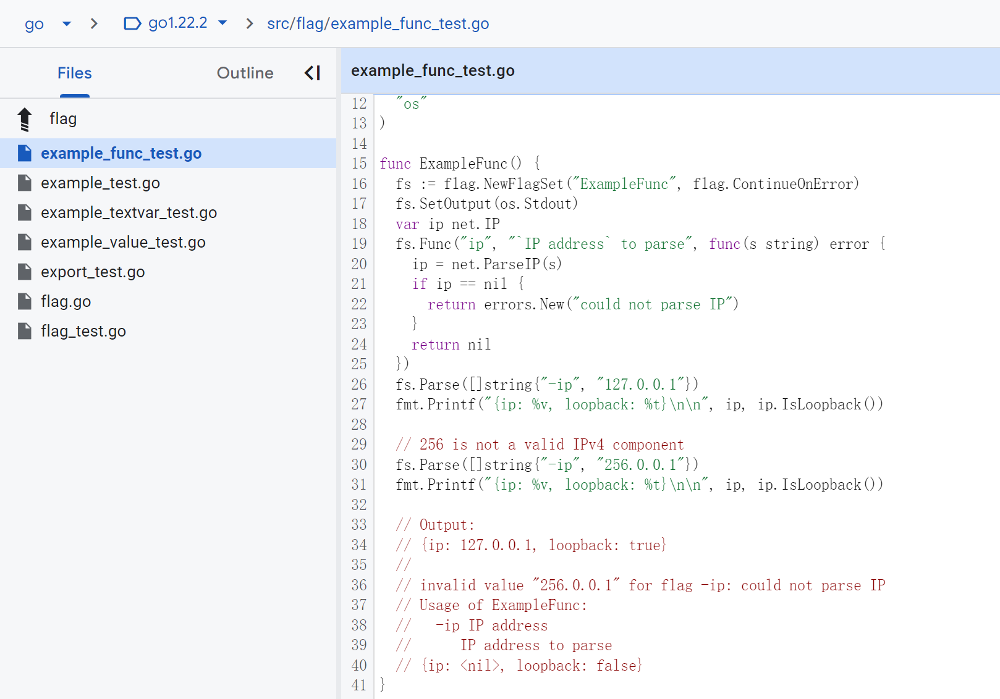

# Go test 的一些容易忽略的约定俗成：TestMain、Example....

A few commonly overlooked conventions of Go testing

## 命名规范

Go 语言的 `testing` 包提供对 Go 包的自动化测试支持。它与 "go test" 命令一起使用，该命令自动化执行任何形式为：

```go
func TestXxx(*testing.T)
```

的函数，其中 Xxx 不以下划线开头。函数名称用来标识测试例。

在这些函数内部，使用 Error、Fail 或相关方法来表示失败。

要编写一个新的测试套件，创建一个包含这里描述的 TestXxx 函数的文件，并给该文件命名为以 "_test.go" 结尾的名称。该文件将从常规包构建中排除，但当运行 "go test" 命令时将被包含。

测试文件可以与被测试的包在同一个包内，或者在带有后缀 "_test" 的对应包中。

如果测试文件与被测试的包在同一个包内，它可以引用包内的未导出标识符，如以下示例：

```go
package abs

import "testing"

func TestAbs(t *testing.T) {
    got := Abs(-1)
    if got != 1 {
        t.Errorf("Abs(-1) = %d; want 1", got)
    }
}
```

如果文件位于单独的 "_test" 包中，被测试的包必须被显式导入，并且只能使用其导出的标识符。这被称为“黑盒”测试。

```go
package abs_test

import (
    "testing"

    "path_to_pkg/abs"
)

func TestAbs(t *testing.T) {
    got := abs.Abs(-1)
    if got != 1 {
        t.Errorf("Abs(-1) = %d; want 1", got)
    }
}
```

有关更多细节，运行 "go help test" 和 "go help testflag"。

## 基准测试

> 这个目前为止，还没遇到例子，亲自遇到例子我再来更新

形式为

```go
func BenchmarkXxx(*testing.B)
```

的函数被视为基准测试，并在 "go test" 命令提供 -bench 标志时执行。基准测试按顺序运行。

有关测试标志的描述，请访问 [https://golang.org/cmd/go/#hdr-Testing_flags](https://golang.org/cmd/go/#hdr-Testing_flags)。

一个基准测试函数的示例如下：

```go
func BenchmarkRandInt(b *testing.B) {
    for i := 0; i < b.N; i++ {
        rand.Int()
    }
}
```

基准测试函数必须按照目标代码 b.N 次运行。在基准测试执行期间，b.N 将被调整，直到基准测试函数运行时间足够长，可以可靠地计时。输出

```
BenchmarkRandInt-8           68453040                17.8 ns/op
```

意味着循环运行了 68453040 次，每次循环的速度为 17.8 纳秒。

如果基准测试需要在运行前进行一些昂贵的设置，则可以重置计时器：

```go
func BenchmarkBigLen(b *testing.B) {
    big := NewBig()
    b.ResetTimer()
    for i := 0; i < b.N; i++ {
        big.Len()
    }
}
```

如果基准测试需要在并行设置中测试性能，可以使用 RunParallel 辅助函数；这类基准测试旨在与 go test -cpu 标志一起使用：

```go
func BenchmarkTemplateParallel(b *testing.B) {
    templ := template.Must(template.New("test").Parse("Hello, {{.}}!"))
    b.RunParallel(func(pb *testing.PB) {
        var buf bytes.Buffer
        for pb.Next() {
            buf.Reset()
            templ.Execute(&buf, "World")
        }
    })
}
```

基准测试结果格式的详细规范在 [https://golang.org/design/14313-benchmark-format](https://golang.org/design/14313-benchmark-format) 给出。

处理基准测试结果的标准工具位于 [https://golang.org/x/perf/cmd](https://golang.org/x/perf/cmd)。特别是，[https://golang.org/x/perf/cmd/benchstat](https://golang.org/x/perf/cmd/benchstat) 执行统计上稳健的 A/B 比较。

## Example

### 为啥要有这个东西？

> 关于为啥要有这个东西，可以看 https://go.dev/blog/examples
> Godoc [examples](https://go.dev/pkg/testing/#hdr-Examples) are snippets of Go code that are displayed as package documentation and that are verified by running them as tests. They can also be run by a user visiting the godoc web page for the package and clicking the associated “Run” button.
> Having executable documentation for a package guarantees that the information will not go out of date as the API changes.（所以说，这相当于一个强制项，当你更新 API 的时候，你的 example 也要对应更新，要不然会报错，挺好）
> The standard library includes many such examples (see the `strings`[ package](https://go.dev/pkg/strings/#Contains), for instance).

> 可以找个包来看一下：
> 
> 通过示例：
> Running the package’s test suite, we can see the example function is executed with no further arrangement from us:
>
> ```
> ```

$ go test -v
=== RUN   TestString
--- PASS: TestString (0.00s)
=== RUN   ExampleString
--- PASS: ExampleString (0.00s)
PASS
ok      golang.org/x/example/hello/reverse  0.209s

```

### 怎么用？

包还运行并验证示例代码。示例函数可以包含以 "Output:" 开头的尾行注释，并在运行测试时与函数的标准输出进行比较。（比较时忽略领先和尾随空格）。以下是示例的示例：

```go
func ExampleHello() {
    fmt.Println("hello")
    // Output: hello
}

func ExampleSalutations() {
    fmt.Println("hello, and")
    fmt.Println("goodbye")
    // Output:
    // hello, and
    // goodbye
}
```

注释前缀 "Unordered output:" 与 "Output:" 类似，但匹配任何行顺序：

```go
func ExamplePerm() {
    for _, value := range Perm(5) {
        fmt.Println(value)
    }
    // Unordered output: 4
    // 2
    // 1
    // 3
    // 0
}
```

没有输出注释的示例函数将被编译但不会被执行。

声明包、函数 F、类型 T 和类型 T 上的方法 M 的示例的命名约定是：

```go
func Example() { ... }
func ExampleF() { ... }
func ExampleT() { ... }
func ExampleT_M() { ... }
```

可以通过在名称后附加一个独特的后缀来为包/类型/函数/方法提供多个示例函数。后缀必须以下划线开头。

```go
func Example_suffix() { ... }
func ExampleF_suffix() { ... }
func ExampleT_suffix() { ... }
func ExampleT_M_suffix() { ... }
```

如果整个测试文件包含一个示例函数，至少一个其他函数、类型、变量或常量声明，并且没有测试或基准测试函数，则将测试文件作为示例展示。

## Fuzzing

'go test' 和 testing 包支持 fuzzing，这是一种测试技术，其中通过使用随机生成的输入调用函数来发现未在单元测试中预见的错误。

被视为 fuzz 测试的函数形式为

```go
func FuzzXxx(*testing.F)
```

例如：

```go
func FuzzHex(f *testing.F) {
    for _, seed := range [][]byte{{0}, {9}, {0xa}, {0xf}, {1, 2, 3, 4}} {
        f.Add(seed)
    }
    f.Fuzz(func(t *testing.T, in []byte) {
        enc := hex.EncodeToString(in)
        out, err := hex.DecodeString(enc)
        if err != nil {
            t.Fatalf("%v: decode: %v", in, err)
        }
        if !bytes.Equal(in, out) {
            t.Fatalf("%v: not equal after round trip: %v", in, out)
        }
    })
}
```

fuzz 测试维护了一个种子语料库，即默认运行的输入集，可以用于种子输入生成。可以通过调用 (*F).Add 注册种子输入，也可以通过将文件存储在包中包含 fuzz 测试的 testdata/fuzz/<Name> 目录中（其中 <Name> 是 fuzz 测试的名称）。种子输入是可选的，但当提供一组小型种子输入和良好的代码覆盖率时，fuzzing 引擎可能更有效地发现错误。这些种子输入也可以作为通过 fuzzing 确定的错误的回归测试。

传递给 (*F).Fuzz 内的 fuzz 测试的函数被认为是 fuzz 目标。fuzz 目标必须接受一个 *T 参数，后跟一个或多个用于随机输入的参数。传递给 (*F).Add 的参数的类型必须与这些参数的类型完全相同。fuzz 目标可以像测试一样发出它发现问题的信号：通过调用 T.Fail（或任何调用它的方法是 T.Error 或 T.Fatal）或引发 panic。

当启用 fuzzing（通过将 -fuzz 标志设置为与特定 fuzz 测试匹配的正则表达式）时，将使用通过随机更改种子输入生成的参数调用 fuzz 目标。在支持的平台上，'go test' 会使用 fuzzing 覆盖率工具编译测试可执行文件。fuzzing 引擎使用该工具来查找并缓存输入，这些输入扩展了覆盖范围，增加了发现错误的可能性。如果 fuzz 目标对给定输入失败，fuzzing 引擎会将导致失败的输入写入文件，在包目录中的 testdata/fuzz/<Name> 目录内。此文件后来用作种子输入。如果无法在该位置写入文件（例如，因为目录是只读的），fuzzing 引擎会将文件写入构建缓存内的 fuzz 缓存目录中。

当禁用 fuzzing 时，将使用 F.Add 注册的种子输入和来自 testdata/fuzz/<Name> 的种子输入调用 fuzz 目标。在此模式下，fuzz 测试的行为很像常规测试，使用 F.Fuzz 而不是 T.Run 启动子测试。

有关 fuzzing 的文档，请访问 https://go.dev/doc/fuzz。

## 跳过

可以使用 *T 或 *B 的 Skip 方法在运行时跳过测试或基准测试：

```go
func TestTimeConsuming(t *testing.T) {
    if testing.Short() {
        t.Skip("skipping test in short mode.")
    }
    // ...
}
```

如果输入无效，则可以在模糊目标中使用 *T 的 Skip 方法，但不应将其视为失败输入。例如：

```go
// 在 fuzz 目标中，如果输入无效，但不应被视为失败输入，可以使用 *T 的 Skip 方法。
func FuzzJSONMarshaling(f *testing.F) {
    f.Fuzz(func(t *testing.T, b []byte) {
        var v interface{}
        if err := json.Unmarshal(b, &v); err != nil {
            t.Skip()
        }
        if _, err := json.Marshal(v); err != nil {
            t.Errorf("Marshal: %v", err)
        }
    })
}
```

### 子测试和子基准测试

T 和 B 的 Run 方法允许定义子测试和子基准测试，而无需为每个测试定义单独的函数。这使得可以使用表驱动的基准测试和创建层次结构测试。它还提供了一种共享通用设置和拆除代码的方法：

```go
func TestFoo(t *testing.T) {
    // <setup code>
    t.Run("A=1", func(t *testing.T) { ... })
    t.Run("A=2", func(t *testing.T) { ... })
    t.Run("B=1", func(t *testing.T) { ... })
    // <tear-down code>
}
```

每个子测试和子基准测试都有一个唯一的名称：顶层测试的名称与传递给 Run 的名称的组合，由斜杠分隔，对于消歧可添加一个可选的尾随序列号。

传递给 -run、-bench 和 -fuzz 命令行标志的参数是一个不锚定的正则表达式，与测试的名称匹配。对于具有多个斜杠分隔元素的测试，例如子测试，参数本身也是由斜杠分隔的，表达式依次匹配每个名称元素。因为它是不锚定的，一个空表达式匹配任何字符串。

例如，使用 "matching" 表示 "其名称包含"：

```bash
go test -run ''        # 运行所有测试。
go test -run Foo       # 运行匹配 "Foo" 的顶层测试，例如 "TestFooBar"。
go test -run Foo/A=    # 对于匹配 "Foo" 的顶层测试，运行匹配 "A=" 的子测试。
go test -run /A=1      # 对于所有顶层测试，运行匹配 "A=1" 的子测试。
go test -fuzz FuzzFoo  # fuzz 匹配 "FuzzFoo" 的目标
```

-run 参数还可以用来运行种子语料库中的特定值，用于调试。例如：

```bash
go test -run=FuzzFoo/9ddb952d9814
```

-fuzz 和 -run 标志都可以设置，以便 fuzz 一个目标但跳过所有其他测试的执行。

子测试还可以用于控制并行性。一旦所有子测试完成，父测试才会完成。在这个例子中，所有测试都彼此并行运行，并且仅此而已，不管可能定义的其他顶层测试如何：

```go
func TestGroupedParallel(t *testing.T) {
    for _, tc := range tests {
        tc := tc // capture range variable
        t.Run(tc.Name, func(t *testing.T) {
            t.Parallel()
            // ...
        })
    }
}
```

Run 直到并行子测试完成才返回，提供了一种在一组并行测试后进行清理的方法：

```go
func TestTeardownParallel(t *testing.T) {
    // 这个 Run 直到并行测试完成才返回。
    t.Run("group", func(t *testing.T) {
        t.Run("Test1", parallelTest1)
        t.Run("Test2", parallelTest2)
        t.Run("Test3", parallelTest3)
    })
    // <tear-down code>
}
```

## 主函数 TestMain

有时，**测试或基准测试程序需要在执行前后进行额外的设置或清理**。有时，还需要控制哪些代码在主线程上运行。为了支持这些和其他情况，如果测试文件包含一个函数：

```go
func TestMain(m *testing.M)
```

那么生成的测试将调用 TestMain(m) 而不是直接运行测试或基准测试。TestMain 在主 goroutine 中运行，并且可以在对 m.Run 的调用周围执行任何必要的设置和清理。m.Run 将返回一个退出码，该退出码可以传递给 os.Exit。如果 TestMain 返回，测试包装器将把 m.Run 的结果传递给 os.Exit 本身。

当调用 TestMain 时，flag.Parse 尚未运行。如果 TestMain 依赖于命令行标志，包括 testing 包的标志，它应该显式调用 flag.Parse。当测试或基准测试函数运行时，命令行标志总是已经被解析。

一个简单的 TestMain 实现是：

```go
func TestMain(m *testing.M) {
    // 在这里调用 flag.Parse，如果 TestMain 使用标志
    os.Exit(m.Run())
}
```

TestMain 是一个低级原语，对于普通的测试需求，通常的测试函数就足够了。

### 今天遇到了，在 grpcurl 的测试里面

```go
func TestMain(m *testing.M) {
    var err error
    sourceProtoset, err = DescriptorSourceFromProtoSets("internal/testing/test.protoset")
    if err != nil {
        panic(err)
    }
    sourceProtoFiles, err = DescriptorSourceFromProtoFiles([]string{"internal/testing"}, "test.proto")
    if err != nil {
        panic(err)
    }

    // Create a server that includes the reflection service
    svrReflect := grpc.NewServer()
    grpcurl_testing.RegisterTestServiceServer(svrReflect, grpcurl_testing.TestServer{})
    reflection.Register(svrReflect)
    var portReflect int
    if l, err := net.Listen("tcp", "127.0.0.1:0"); err != nil {
        panic(err)
    } else {
        portReflect = l.Addr().(*net.TCPAddr).Port
        go svrReflect.Serve(l)
    }
    defer svrReflect.Stop()

    // And a corresponding client
    ctx, cancel := context.WithTimeout(context.Background(), 10*time.Second)
    defer cancel()
    if ccReflect, err = grpc.DialContext(ctx, fmt.Sprintf("127.0.0.1:%d", portReflect),
        grpc.WithTransportCredentials(insecure.NewCredentials()), grpc.WithBlock()); err != nil {
        panic(err)
    }
    defer ccReflect.Close()
    refClient := grpcreflect.NewClientAuto(context.Background(), ccReflect)
    defer refClient.Reset()

    sourceReflect = DescriptorSourceFromServer(context.Background(), refClient)

    // Also create a server that does *not* include the reflection service
    svrProtoset := grpc.NewServer()
    grpcurl_testing.RegisterTestServiceServer(svrProtoset, grpcurl_testing.TestServer{})
    var portProtoset int
    if l, err := net.Listen("tcp", "127.0.0.1:0"); err != nil {
        panic(err)
    } else {
        portProtoset = l.Addr().(*net.TCPAddr).Port
        go svrProtoset.Serve(l)
    }
    defer svrProtoset.Stop()

    // And a corresponding client
    ctx, cancel = context.WithTimeout(context.Background(), 10*time.Second)
    defer cancel()
    if ccNoReflect, err = grpc.DialContext(ctx, fmt.Sprintf("127.0.0.1:%d", portProtoset),
        grpc.WithTransportCredentials(insecure.NewCredentials()), grpc.WithBlock()); err != nil {
        panic(err)
    }
    defer ccNoReflect.Close()

    descSources = []descSourceCase{
        {"protoset", sourceProtoset, false},
        {"proto", sourceProtoFiles, false},
        {"reflect", sourceReflect, true},
    }

    **os.Exit(m.Run())**
}
```
