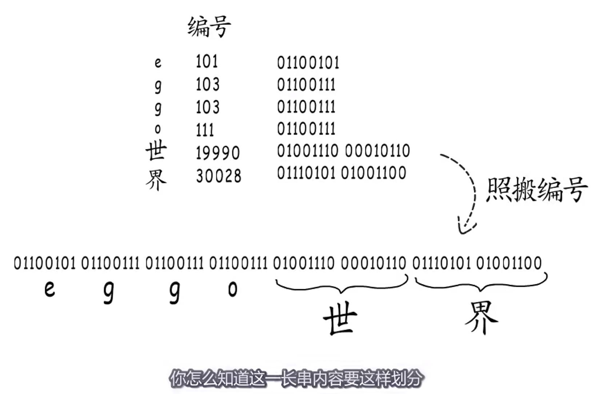
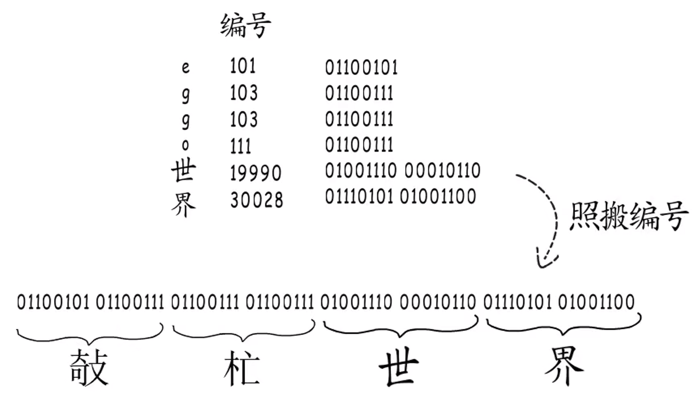
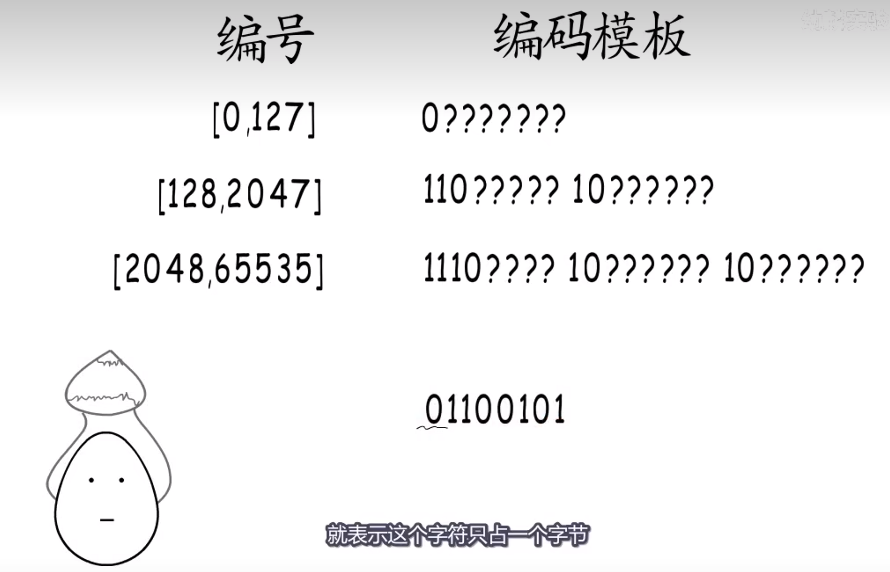
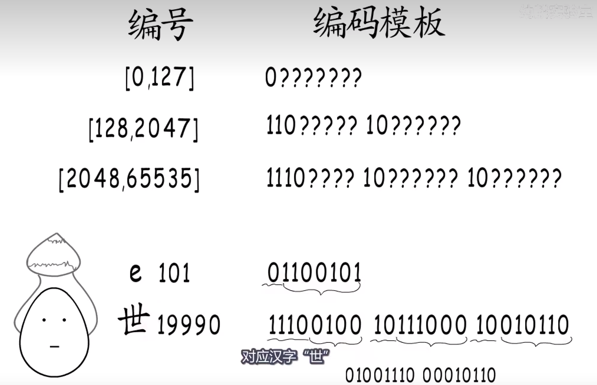
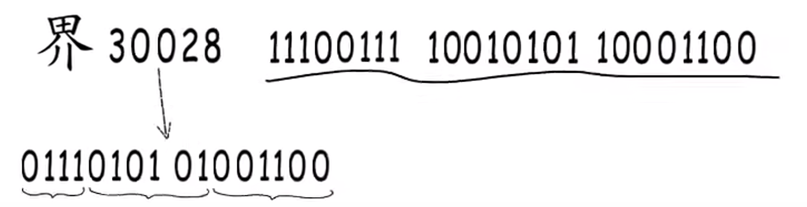
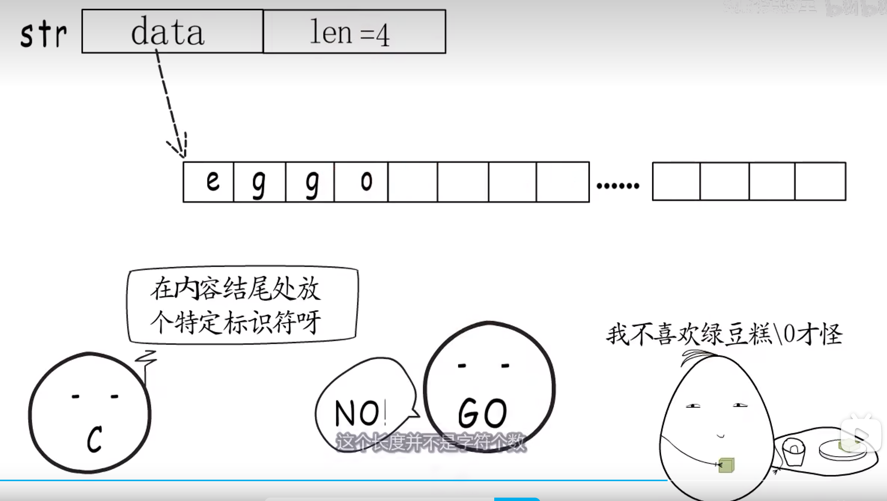
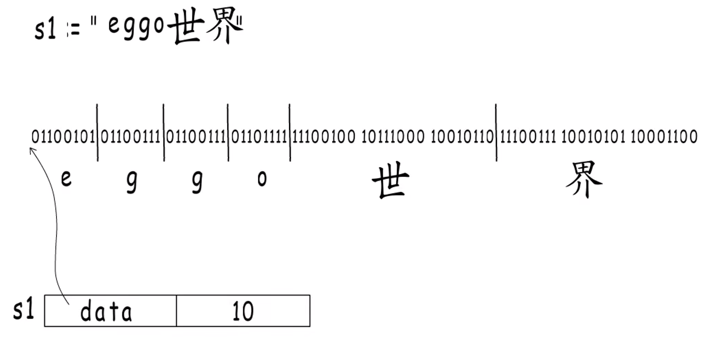
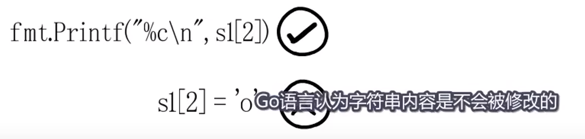
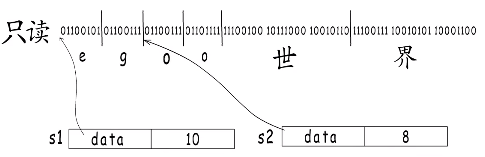
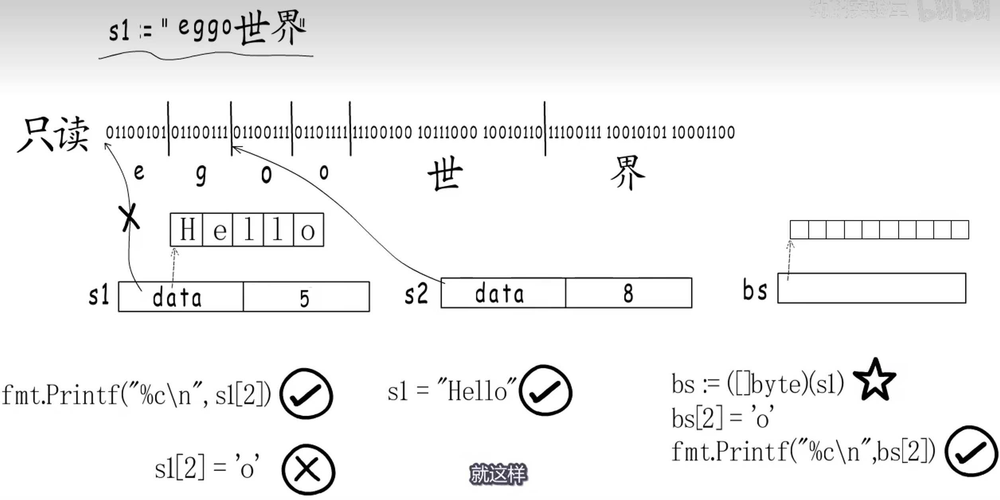

> [https://www.bilibili.com/video/BV1hv411x7we](https://www.bilibili.com/video/BV1hv411x7we)

## 从 UTF-8 编码到 Go 语言中的 string

最直接的编码想法

乱码的原因，主要问题是划分字符边界。

可以统一按照最长的位数来，搞一个定长编码，位数不够，高位补零。

但是，浪费内存。

还得变长编码。哈夫曼编码出来了

> 哈夫曼编码 要求 没有公共子前缀

每个字节开始的标志位，映射到对应的编码模板，然后再把对应的实际数据取出，拼成编号

编码怎么办？

先找到这个字符的编号所在的区间，然后找对这个区间对应的编码模板，依次把编号拆分，填入到编码模板里面即可。

这就是 UTF-8 编码，也是 Go 语言默认的编码模式。

然后我们看一下 string 是如何存储的

C 语言中，是一串字符数组，以'\0'结尾。

Go 的话，并不是这样，而是多存了一个长度

这个长度是字节个数，而不是字符个数。因为有可能一个字符占用多个字节。

Go 语言里面的字符串变量就长这样。

字符串只能读取，不能修改。Go 编译器会把上面那样定义的字符串分配到只读内存段。

为什么不能被修改？

因为字符串变量是可以共用底层字符串内容的，一个的修改可能会影响到另一个，这个是不行的。

如果要修改，可以赋新的值。

也可以把变量强制转换成字节 slice，这样会为 slice 重新分配一段内存，并拷贝原来字符串的内容。

> 但是注意：
> 字面量（静态变量）的 string 无法修改， 非字面的 string unsafe 转为[]byte 后可修改

